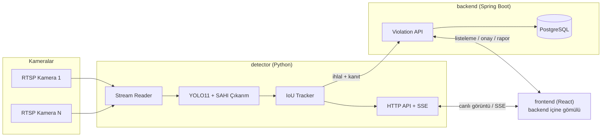

# Endüstriyel Baret Tespit Sistemi

Tersane ve fabrika sahalarında, çok kameralı canlı RTSP akışları üzerinden **kasksız (baretsiz) personeli gerçek zamanlı tespit eden**, ihlalleri kaydeden ve merkezi olarak raporlayan uçtan uca bir iş güvenliği izleme sistemi.

YOLO11 tabanlı bir nesne tespit modeli, SAHI dilimli çıkarım ile küçük/uzak nesnelerde yüksek doğruluk sağlar; çok kameralı GPU zamanlayıcısı, kimlik takibi (tracking) ve soğuma süresi mantığıyla aynı kişi için tekrar tekrar ihlal kaydı oluşmasını önler. Tespit edilen ihlaller kanıt görseliyle birlikte merkezi bir veritabanına işlenir ve web arayüzünden canlı izlenip onaylanabilir.

## Öne Çıkan Özellikler

- **Çok kameralı canlı izleme** — round-robin zamanlama, kamera başına bağımsız yeniden bağlanma/geri çekilme (backoff) mantığı.
- **YOLO11 + isteğe bağlı SAHI dilim modu** — büyük çözünürlüklü kareler dilimlere bölünüp ayrı ayrı işlenebilir (küçük/uzak nesne tespiti için); performans/doğruluk dengesini kurmak üzere dilim sayısı ve ek tam-kare geçişi ayrı ayrı açılıp kapatılabilir.
- **Kimlik takibi (IoU tracker) + soğuma süresi** — aynı kişi kadraj içinde kaldığı sürece tekrar tekrar ihlal loglanmaz; takip süresi kare hızından bağımsız gerçek zamanla (saniye) ölçülür.
- **Canlı GPU/zamanlama metrikleri** — anlık GPU kullanımı, VRAM, tur süresi ve kamera bazlı gecikme durumu arayüzden izlenebilir; model çalışması arayüzden duraklatılıp devam ettirilebilir.
- **Arayüzden canlı ayarlanabilir çıkarım parametreleri** — GPU'ya aynı anda kaç kameranın verileceği (`batch_size`) arayüzden onaylı şekilde değiştirilebilir, restart gerekmez.
- **Kamera ızgarasında tespit noktaları** — hiçbir kamera seçili değilken bile, tüm kameraların küçük önizlemelerinde kişi bazlı yeşil/kırmızı nokta overlay'i ile anlık durum özeti.
- **İhlal kanıt zinciri** — her ihlal için tam kare + kırpılmış kanıt görseli diske ve merkezi backend'e (Postgres) kaydedilir; web arayüzünden onay/red iş akışı ve PDF rapor üretimi.
- **Docker Compose ile tek komutla dağıtım** — detector (Python/GPU), backend (Spring Boot), frontend (React, backend içine gömülü) ve Postgres tek `docker compose up` ile ayağa kalkar.

## Mimari



## Teknoloji Yığını

| Bileşen | Teknoloji |
|---|---|
| Tespit motoru (`sunucu/detector`) | Python, PyTorch 2.6, Ultralytics YOLO11, SAHI, OpenCV |
| Backend (`sunucu/backend`) | Java 21, Spring Boot 4.1, PostgreSQL 16 |
| Frontend (`sunucu/frontend`) | React 19, Vite |
| Dağıtım | Docker Compose, NVIDIA CUDA 12.4 |

## Hızlı Başlangıç

Ön koşullar: Docker + Docker Compose, NVIDIA GPU + `nvidia-container-toolkit` (detector için).

```bash
git clone <bu-repo>
cd <bu-repo>

# Gizli/ortam değişkenlerini örnekten türet
cp .env.example sunucu/.env
cp sunucu/config.yaml.example sunucu/config.yaml
cp sunucu/config.docker.yaml.example sunucu/config.docker.yaml
# sunucu/.env ve config*.yaml içindeki api_key değerlerini kendi
# ürettiğiniz bir değerle değiştirin (ikisi AYNI olmalı).

docker compose up -d --build
```

Detector API: `http://localhost:8090` · Web arayüzü (backend içine gömülü): `http://localhost:8080`

Sürücünüzün desteklediği CUDA sürümü 12.4'ten düşükse:

```bash
TORCH_BASE_IMAGE=pytorch/pytorch:2.6.0-cuda11.8-cudnn9-runtime docker compose up -d --build
```

## Yapılandırma

Tüm çalışma zamanı ayarları `sunucu/config.yaml` (yerel) / `sunucu/config.docker.yaml` (Docker) dosyalarında toplanır — kamera akış zamanlaması, model eşikleri, SAHI dilimleme, kimlik takibi (tracker) ve ihlal loglama davranışı buradan kontrol edilir. Kamera listesi ayrı bir JSON dosyasında (`sunucu/cameras.json` / `sunucu/cameras.docker.json`) tutulur ve çalışma anında API üzerinden de yönetilebilir.

## Proje Yapısı

```
sunucu/
├─ detector/        # Python tespit motoru (YOLO11 + SAHI, tracker, HTTP API)
│  ├─ app/
│  └─ models/       # Model ağırlıkları (best.pt)
├─ backend/         # Spring Boot API + PostgreSQL entegrasyonu
├─ frontend/        # React arayüzü (backend build'ine gömülür)
├─ config.yaml.example
├─ config.docker.yaml.example
└─ cameras*.json
docker-compose.yml
```
