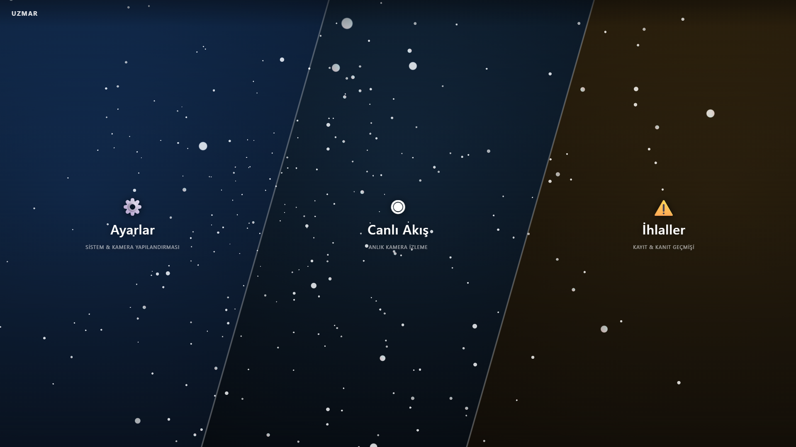
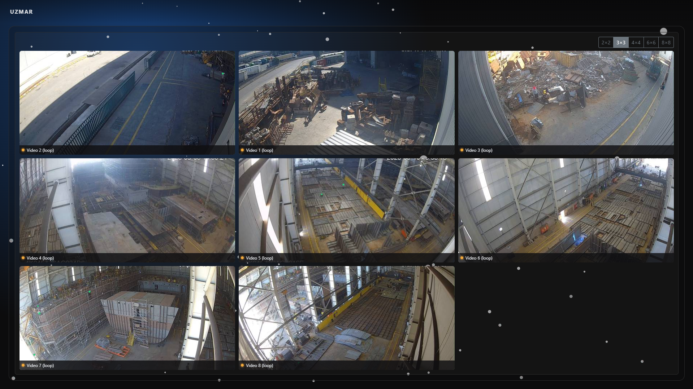
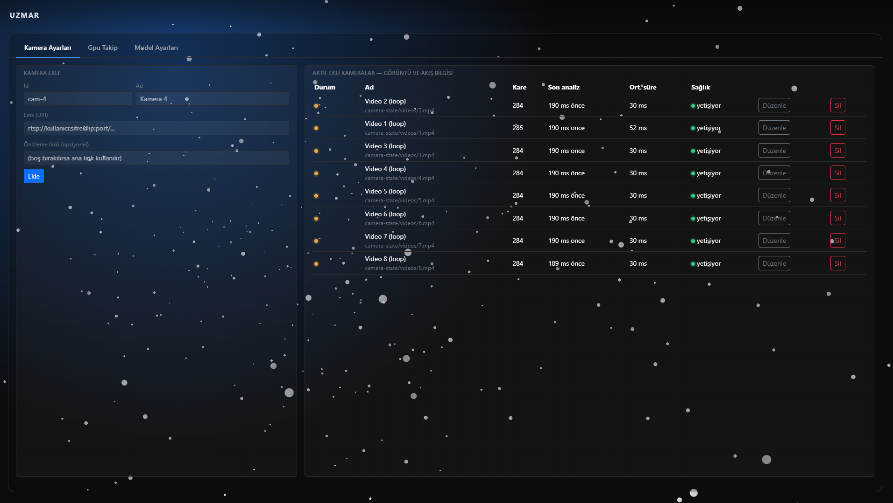
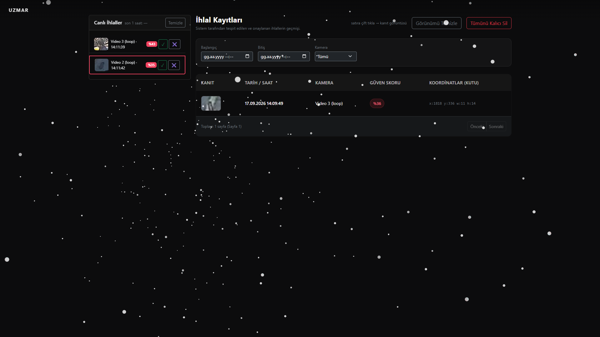
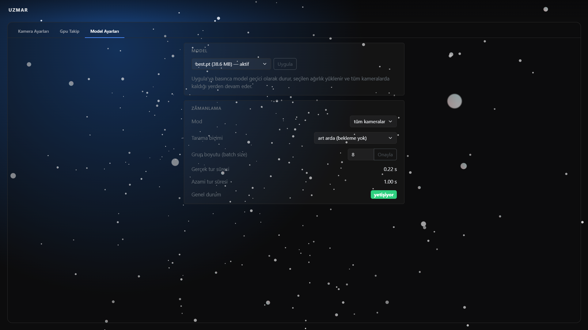
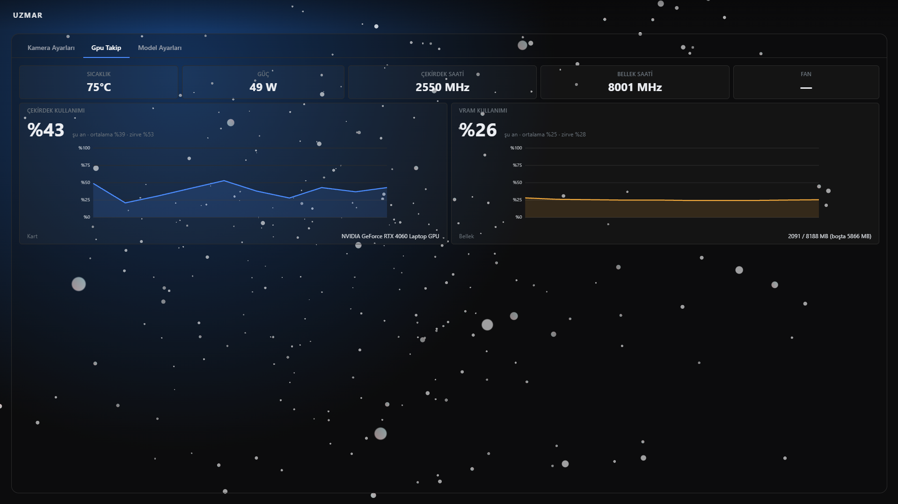
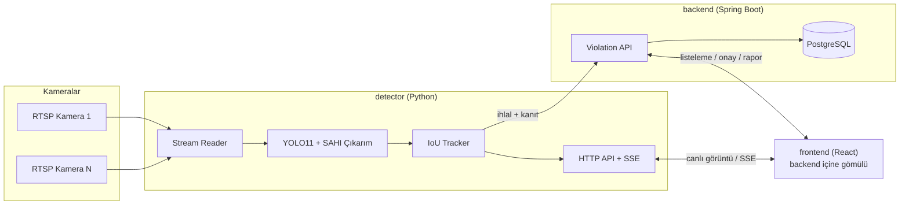

# Endüstriyel Baret Tespit Sistemi

Tersane ve fabrika sahalarında, çok kameralı canlı RTSP akışları üzerinden **kasksız (baretsiz) personeli gerçek zamanlı tespit eden**, ihlalleri kaydeden ve merkezi olarak raporlayan uçtan uca bir iş güvenliği izleme sistemi.

YOLO11 tabanlı bir nesne tespit modeli, SAHI dilimli çıkarım ile küçük/uzak nesnelerde yüksek doğruluk sağlar; çok kameralı GPU zamanlayıcısı, kimlik takibi (tracking) ve soğuma süresi mantığıyla aynı kişi için tekrar tekrar ihlal kaydı oluşmasını önler. Tespit edilen ihlaller kanıt görseliyle birlikte merkezi bir veritabanına işlenir ve web arayüzünden canlı izlenip onaylanabilir.

## Öne Çıkan Özellikler

- **Çok kameralı canlı izleme** — round-robin zamanlama, kamera başına bağımsız yeniden bağlanma/geri çekilme (backoff) mantığı.
- **YOLO11 + isteğe bağlı SAHI dilim modu** — büyük çözünürlüklü kareler dilimlere bölünüp ayrı ayrı işlenebilir (küçük/uzak nesne tespiti için); performans/doğruluk dengesini kurmak üzere dilim sayısı ve ek tam-kare geçişi ayrı ayrı açılıp kapatılabilir.
- **Kimlik takibi (IoU tracker) + soğuma süresi** — aynı kişi kadraj içinde kaldığı sürece tekrar tekrar ihlal loglanmaz; takip süresi kare hızından bağımsız gerçek zamanla (saniye) ölçülür.
- **Canlı GPU/zamanlama metrikleri** — anlık GPU kullanımı, VRAM, tur süresi ve kamera bazlı gecikme durumu arayüzden izlenebilir; model çalışması arayüzden duraklatılıp devam ettirilebilir.
- **Arayüzden canlı ayarlanabilir çıkarım parametreleri** — GPU'ya aynı anda kaç kameranın verileceği (`batch_size`) arayüzden onaylı şekilde değiştirilebilir, restart gerekmez.
- **Kamera ızgarasında tespit noktaları** — hiçbir kamera seçili değilken bile, tüm kameraların küçük önizlemelerinde kişi bazlı yeşil/kırmızı nokta overlay'i ile anlık durum özeti.
- **İhlal kanıt zinciri** — her ihlal için tam kare + kırpılmış kanıt görseli diske ve merkezi backend'e (Postgres) kaydedilir; web arayüzünden onay/red iş akışı ve PDF rapor üretimi.

## Ekran Görüntüleri

| Ana menü | Çok kameralı izleme |
|---|---|
|  |  |

| Kamera yönetimi | İhlal kayıtları |
|---|---|
|  |  |

| Model seçimi & zamanlama | GPU/tur metrikleri |
|---|---|
|  |  |

## Mimari


```mermaid
flowchart LR
    subgraph Kameralar
        C1[RTSP Kamera 1]
        C2[RTSP Kamera N]
    end
    subgraph Detector["detector (Python)"]
        SR[Stream Reader]
        INF["YOLO11 + SAHI Çıkarım"]
        TRK[IoU Tracker]
        API["HTTP API + SSE"]
    end
    subgraph Backend["backend (Spring Boot)"]
        BE[Violation API]
        PG[(PostgreSQL)]
    end
    FE["frontend (React)\nbackend içine gömülü"]

    C1 & C2 --> SR --> INF --> TRK --> API
    TRK -->|ihlal + kanıt| BE --> PG
    API <-->|canlı görüntü / SSE| FE
    BE <-->|listeleme / onay / rapor| FE
```

## Teknoloji Yığını

| Bileşen | Teknoloji |
|---|---|
| Tespit motoru (`sunucu/detector`) | Python, PyTorch 2.6, Ultralytics YOLO11, SAHI, OpenCV |
| Backend (`sunucu/backend`) | Java 21, Spring Boot 4.1, PostgreSQL 16 |
| Frontend (`sunucu/frontend`) | React 19, Vite |
| Dağıtım | Yerel süreçler (PowerShell betikleri), NVIDIA CUDA 12.4 |
| Dağıtım (opsiyonel) | Docker Hub imajları (`themrgndzd/ppe-backend`, `themrgndzd/ppe-detector`) + Compose |

## Hızlı Başlangıç

Ön koşullar: Java 21 + Maven Wrapper, Node.js 20+, Python 3.11+, PostgreSQL 16, NVIDIA GPU + CUDA (detector için).

```powershell
git clone <bu-repo>
cd <bu-repo>

# Git LFS: model ağırlıkları (sunucu/detector/models/*.pt) LFS üzerinden gelir
git lfs install
git lfs pull

# Gizli/ortam değişkenlerini örnekten türet
cp .env.example sunucu/.env
cp sunucu/config.yaml.example sunucu/config.yaml
# sunucu/.env ve sunucu/config.yaml içindeki api_key değerlerini kendi
# ürettiğiniz bir değerle değiştirin (ikisi AYNI olmalı).

powershell -ExecutionPolicy Bypass -File sunucu\tools\start.ps1
```

Detector API: `http://localhost:8090` · Web arayüzü (backend içine gömülü): `http://localhost:8080`

Durdurmak için:

```powershell
powershell -ExecutionPolicy Bypass -File sunucu\tools\stop.ps1
```

## Docker ile Çalıştırma (Docker Hub'dan pull)

Karşı makine (GPU sunucu veya GPU'suz test makinesi) **hiçbir şey build etmez** —
hazır imajlar Docker Hub'dan (`themrgndzd/ppe-backend`, `themrgndzd/ppe-detector`,
public) çekilir. Aynı imaj iki ortamda da çalışır; tek fark `config.yaml`
içindeki `model.device` ("cpu" / "cuda:0") ve `docker-compose.gpu.yml`'in
uygulanıp uygulanmamasıdır.

**Geliştirme makinesinde (imaj build + push, bir kere / her güncellemede):**

```powershell
powershell -ExecutionPolicy Bypass -File sunucu\tools\docker-build-push.ps1
```

**Karşı makinede (test PC veya GPU sunucu, Docker + Docker Compose kurulu olmalı):**

```bash
git clone <bu-repo>
cd <bu-repo>

cp .env.example .env
# PG_*/BACKEND_API_KEY değerlerini kendi ürettiğiniz değerlerle doldurun.

mkdir -p sunucu/docker-data/config sunucu/docker-data/logs
cp sunucu/config.docker.yaml.example sunucu/docker-data/config/config.yaml
# api_key'i .env'deki BACKEND_API_KEY ile AYNI yapın.
# GPU yoksa model.device: "cpu" bırakın; GPU sunucuda "cuda:0" yapın.
echo "[]" > sunucu/docker-data/config/cameras.json

# GPU'suz test makinesi:
docker compose pull
docker compose up -d

# GPU sunucu (host'ta NVIDIA driver + nvidia-container-toolkit kurulu olmalı):
docker compose -f docker-compose.yml -f docker-compose.gpu.yml pull
docker compose -f docker-compose.yml -f docker-compose.gpu.yml up -d
```

Web arayüzü: `http://localhost:8080` · Detector API: `http://localhost:8090`.
Durdurmak için `docker compose down` (veriler `pgdata`/`backend_storage`
named volume'larında ve `sunucu/docker-data/` dizininde kalıcı kalır).

`sunucu/docker-data/` (config.yaml + cameras.json + logs) sır içerdiği için
repoya girmez (`.gitignore`); her makinede elle bir kez hazırlanır.

## Yapılandırma

Tüm çalışma zamanı ayarları `sunucu/config.yaml` dosyasında toplanır — kamera akış zamanlaması, model eşikleri, SAHI dilimleme, kimlik takibi (tracker) ve ihlal loglama davranışı buradan kontrol edilir. Kamera listesi ayrı bir JSON dosyasında (`sunucu/cameras.json`) tutulur ve çalışma anında API üzerinden de yönetilebilir.

`sunucu/detector/models/` altında birden fazla eğitim çıktısı (`best.pt`, `bestEski.pt`, `bestGüncel.pt`, `epoch70.pt`) Git LFS ile depoda tutulur; aktif model, web arayüzündeki **Model Ayarları** sekmesinden (yukarıdaki ekran görüntüsü) yeniden başlatma gerekmeden değiştirilip zamanlanabilir.

## Proje Yapısı

```
sunucu/
├─ detector/        # Python tespit motoru (YOLO11 + SAHI, tracker, HTTP API); Dockerfile burada
│  ├─ app/
│  └─ models/       # Model ağırlıkları (best.pt, bestEski.pt, bestGüncel.pt, epoch70.pt — Git LFS)
├─ backend/         # Spring Boot API + PostgreSQL entegrasyonu; Dockerfile burada
├─ frontend/        # React arayüzü (backend build'ine gömülür)
├─ tools/           # start.ps1 / stop.ps1 / pg-start.ps1 / pg-stop.ps1 / docker-build-push.ps1
├─ docker-data/     # (gitignore'da) config.yaml + cameras.json + logs — docker-compose bind-mount
├─ config.yaml.example
├─ config.docker.yaml.example
└─ cameras.json
docker-compose.yml
docker-compose.gpu.yml
docs/
└─ screenshots/     # README'deki arayüz ekran görüntüleri
```
